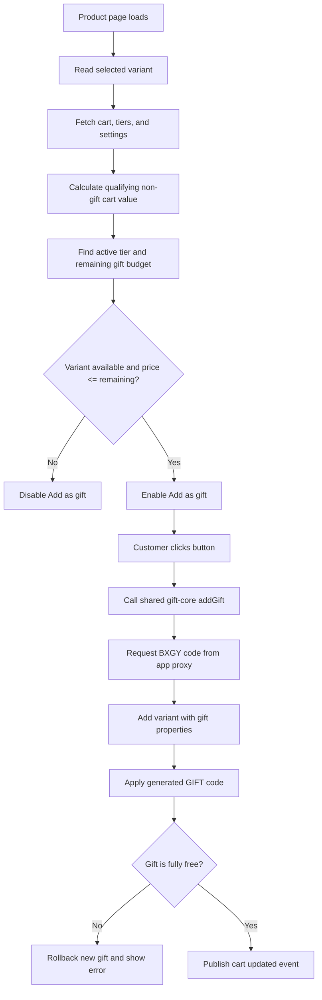
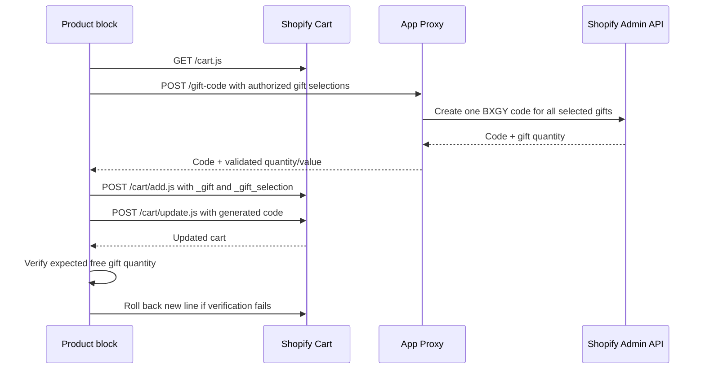

# План разработки Gift Threshold App

## 1. Архитектура приложения

```
┌─────────────────────────────────────────────────────────────────┐
│                        SHOPIFY STORE                            │
│                                                                 │
│  ┌──────────────┐   ┌──────────────┐   ┌──────────────────┐    │
│  │  Storefront   │   │   Cart       │   │   Checkout       │    │
│  │  (витрина)    │   │   (корзина)  │   │   (оформление)   │    │
│  │              │   │              │   │                  │    │
│  │  Товары      │   │ ┌──────────┐ │   │ ┌──────────────┐ │    │
│  │  Коллекции   │   │ │ Виджет   │ │   │ │ Cart         │ │    │
│  │  Поиск       │   │ │ подарка  │ │   │ │ Transform    │ │    │
│  │              │   │ │ (App     │ │   │ │ Function      │ │    │
│  │              │   │ │  Block)  │ │   │ │ (скидка 100%) │ │    │
│  │              │   │ └──────────┘ │   │ └──────────────┘ │    │
│  │              │   │              │   │                  │    │
│  └──────────────┘   └──────────────┘   └──────────────────┘    │
│         │                  │                   │               │
│         │                  │                   │               │
└─────────┼──────────────────┼───────────────────┼───────────────┘
          │                  │                   │
          │ Storefront API   │ /cart.js          │ Shopify Function
          │ (товары)         │ (состояние)       │ (Run API)
          │                  │                   │
          ▼                  ▼                   ▼
┌─────────────────────────────────────────────────────────────────┐
│                     APP BACKEND (Remix)                         │
│                                                                 │
│  ┌──────────┐  ┌──────────┐  ┌──────────┐  ┌──────────────┐   │
│  │ Admin UI │  │ API      │  │ Webhooks │  │ Storefront   │   │
│  │ (пороги) │  │ Routes   │  │ Handler  │  │ API Proxy    │   │
│  └──────────┘  └──────────┘  └──────────┘  └──────────────┘   │
│       │              │              │              │            │
│       └──────────────┴──────────────┴──────────────┘            │
│                             │                                   │
│                    ┌──────────────┐                             │
│                    │   Prisma     │                             │
│                    │   (SQLite)   │                             │
│                    └──────────────┘                             │
└─────────────────────────────────────────────────────────────────┘
```

## 2. Структура проекта

```
gift-threshold-app/
├── app/                          # Remix backend
│   ├── routes/
│   │   ├── _index.tsx            # Dashboard
│   │   ├── app._index.tsx        # Главная админки
│   │   ├── app.tiers.tsx         # Настройка порогов
│   │   ├── app.products.tsx      # Выбор товаров-подарков
│   │   ├── app.settings.tsx      # Общие настройки
│   │   ├── app.history.tsx       # История подарков
│   │   └── webhooks.orders-create.tsx  # Webhook
│   ├── models/
│   │   ├── tier.server.ts        # CRUD порогов
│   │   ├── gift.server.ts        # CRUD подарков
│   │   └── history.server.ts     # История
│   ├── services/
│   │   ├── shopify.server.ts     # Shopify client
│   │   ├── storefront.server.ts  # Storefront API
│   │   └── threshold.server.ts   # Логика расчёта порога
│   └── db.server.ts              # Prisma client
├── extensions/
│   ├── gift-widget/              # Theme App Extension
│   │   ├── blocks/
│   │   │   └── gift-widget.liquid # App Block для корзины
│   │   ├── assets/
│   │   │   ├── gift-widget.js    # Логика виджета
│   │   │   └── gift-widget.css   # Стили
│   │   └── extension.toml
│   └── cart-transform/           # Shopify Function
│       ├── src/
│       │   ├── graphql/
│       │   │   └── cart_transform.graphql
│       │   ├── function.rs       # Rust логика
│       │   └── main.rs
│       ├── Cargo.toml
│       └── extension.toml
├── prisma/
│   └── schema.prisma             # Схема БД
├── shopify.app.toml              # Конфиг приложения
├── package.json
└── README.md
```

## 3. Схема базы данных

```
┌─────────────────────────────────────────────────────────────┐
│                      PRISMA SCHEMA                          │
├─────────────────────────────────────────────────────────────┤
│                                                             │
│  ┌─────────────────────┐     ┌─────────────────────────┐   │
│  │   GiftTier          │     │   GiftProduct           │   │
│  ├─────────────────────┤     ├─────────────────────────┤   │
│  │ id: Int (PK)        │◄───┐│ id: Int (PK)            │   │
│  │ shopId: String      │    ││ shopId: String          │   │
│  │ minAmount: Int      │    └│ tierId: Int (FK)        │   │
│  │ giftPercent: Float  │     │ productId: String       │   │
│  │ collectionId: String│     │ variantId: String       │   │
│  │   (nullable)        │     │ title: String           │   │
│  │ active: Boolean     │     │ price: Int              │   │
│  │ createdAt: DateTime │     │ image: String (nullable)│   │
│  │ updatedAt: DateTime │     │ active: Boolean         │   │
│  └─────────────────────┘     └─────────────────────────┘   │
│                                                             │
│  ┌─────────────────────────────────────────────────────┐   │
│  │   GiftHistory                                       │   │
│  ├─────────────────────────────────────────────────────┤   │
│  │ id: Int (PK)                                        │   │
│  │ shopId: String                                      │   │
│  │ orderId: String                                     │   │
│  │ tierId: Int (FK)                                    │   │
│  │ giftProductId: String                               │   │
│  │ giftProductTitle: String                            │   │
│  │ giftProductPrice: Int                               │   │
│  │ cartTotal: Int                                      │   │
│  │ thresholdBase: Int                                  │   │
│  │ createdAt: DateTime                                 │   │
│  └─────────────────────────────────────────────────────┘   │
│                                                             │
│  ┌─────────────────────────────────────────────────────┐   │
│  │   AppSettings                                       │   │
│  ├─────────────────────────────────────────────────────┤   │
│  │ id: Int (PK)                                        │   │
│  │ shopId: String (unique)                             │   │
│  │ useTotalAfterDiscounts: Boolean (default: true)     │   │
│  │ showLevelUpNotification: Boolean (default: true)    │   │
│  │ showRemovalNotification: Boolean (default: true)    │   │
│  │ active: Boolean (default: true)                     │   │
│  └─────────────────────────────────────────────────────┘   │
│                                                             │
└─────────────────────────────────────────────────────────────┘
```

## 4. Flow — пользовательский путь

```
┌─────────────────────────────────────────────────────────────────┐
│                    ПОЛЬЗОВАТЕЛЬСКИЙ FLOW                         │
└─────────────────────────────────────────────────────────────────┘

  Пользователь заходит в магазин
            │
            ▼
  Добавляет товары в корзину
            │
            ▼
  Открывает страницу корзины (/cart)
            │
            ▼
  ┌─────────────────────────────────────────┐
  │  App Block (gift-widget.liquid)         │
  │                                         │
  │  1. Читать cart.total_price             │
  │  2. Вычесть подарок (если есть)         │
  │  3. Определить активный порог           │
  │  4. Рассчитать maxGiftPrice             │
  │  5. Запросить товары через              │
  │     Storefront API (price <= max)       │
  │  6. Отрисовать виджет                   │
  └─────────────────────────────────────────┘
            │
            ├─ Сумма < минимального порога
            │     → Виджет скрыт
            │
            ├─ Сумма ≥ порога, подарок не выбран
            │     → Показать карусель подарков
            │     → "Выберите подарок до 11.70€"
            │
            ├─ Пользователь выбирает подарок
            │     → POST /cart/add.js (с properties._gift)
            │     → Перерисовать корзину
            │     → Подарок виден в корзине
            │
            ├─ Пользователь применяет промокод
            │     → cart:updated event
            │     → Пересчёт thresholdBase
            │     → Если порог упал → удалить подарок
            │     → Если порог вырос → показать новые подарки
            │
            ▼
  Переход к чекауту (/checkout)
            │
            ▼
  ┌─────────────────────────────────────────┐
  │  Cart Transform Function (Rust)         │
  │                                         │
  │  1. Найти line с properties._gift       │
  │  2. Перепроверить порог                 │
  │     (useTotalAfterDiscounts setting)    │
  │  3. Если порог достигнут →              │
  │     CartTransformOperation:             │
  │       price = 0 (бесплатно)             │
  │  4. Если порог НЕ достигнут →           │
  │     Удалить подарок из заказа           │
  └─────────────────────────────────────────┘
            │
            ▼
  Заказ оформлен
            │
            ▼
  ┌─────────────────────────────────────────┐
  │  Webhook: orders/create                 │
  │                                         │
  │  1. Проверить наличие подарка в заказе  │
  │  2. Записать в GiftHistory              │
  │  3. Сохранить для аналитики             │
  └─────────────────────────────────────────┘
```

## 5. Flow — расчёт порога

```
┌─────────────────────────────────────────────────────────────────┐
│                   РАСЧЁТ ПОРОГА                                  │
└─────────────────────────────────────────────────────────────────┘

  cart.total_price (после всех скидок и промокодов)
         │
         │  минус
         ▼
  giftPrice (цена товара-подарка, 0 если подарка нет)
         │
         │  равно
         ▼
  thresholdBase = cart.total_price - giftPrice
         │
         │
         ▼
  ┌─────────────────────────────────────────────┐
  │  Настройка: useTotalAfterDiscounts          │
  │                                             │
  │  Если TRUE (после промокодов):              │
  │    base = cart.total_price - giftPrice      │
  │                                             │
  │  Если FALSE (до промокодов):                │
  │    base = cart.items_subtotal_price         │
  │           - giftPrice                       │
  └─────────────────────────────────────────────┘
         │
         ▼
  Найти максимальный порог где minAmount <= thresholdBase
         │
         ▼
  maxGiftPrice = tier.minAmount × (tier.giftPercent / 100)
         │
         ▼
  Показать товары с price <= maxGiftPrice

  ─────────────────────────────────────────────

  ПРИМЕРЫ:

  1. Без промокода
     Товары: 135€, Промокод: нет
     thresholdBase = 135€ - 0€ = 135€
     Активный порог: 130€ (9%)
     maxGiftPrice = 130 × 0.09 = 11.70€

  2. С промокодом (режим "после")
     Товары: 145€, Промокод: -15€
     thresholdBase = 130€ - 0€ = 130€
     Активный порог: 130€ (9%)
     maxGiftPrice = 130 × 0.09 = 11.70€

  3. Подарок + промокод (режим "после")
     Товары: 150€, Промокод: -10€, Подарок: 13.30€
     thresholdBase = 140€ - 13.30€ = 126.70€
     Активный порог: НЕТ (ниже 130€)
     → Подарок удаляется

  4. С промокодом (режим "до")
     Товары: 145€, Промокод: -15€
     thresholdBase = 145€ - 0€ = 145€
     Активный порог: 140€ (9.5%)
     maxGiftPrice = 140 × 0.095 = 13.30€
```

## 6. Этапы разработки

```
┌─────────────────────────────────────────────────────────────────┐
│                     ЭТАПЫ РАЗРАБОТКИ                            │
└─────────────────────────────────────────────────────────────────┘

  ЭТАП 1: Скаффолд (1 день)
  ─────────────────────────────
  □ npm create @shopify/app@latest
  □ Создать Theme App Extension
  □ Создать Cart Transform Function
  □ Настроить shopify.app.toml
  □ Git init + первый коммит

           │
           ▼

  ЭТАП 2: База данных + Models (1 день)
  ─────────────────────────────
  □ Prisma schema (GiftTier, GiftProduct, GiftHistory, AppSettings)
  □ Модели: tier.server.ts, gift.server.ts, history.server.ts
  □ Settings server (useTotalAfterDiscounts, notifications)
  □ Миграция Prisma

           │
           ▼

  ЭТАП 3: Admin UI (2 дня)
  ─────────────────────────────
  □ Dashboard — обзор (активные пороги, статистика)
  □ Tiers page — CRUD порогов (minAmount, percent, collection)
  □ Products page — выбор товаров-подарков через Admin API
  □ Settings page — переключатель до/после промокодов
  □ History page — таблица выданных подарков
  □ Shopify App Bridge integration

           │
           ▼

  ЭТАП 4: Theme App Extension (2 дня)
  ─────────────────────────────
  □ gift-widget.liquid (App Block)
  □ gift-widget.js — логика:
    □ Чтение cart.total_price
    □ Расчёт thresholdBase
    □ Определение активного порога
    □ Запрос товаров через Storefront API
    □ Отрисовка карусели подарков
    □ Добавление подарка в корзину (POST /cart/add.js)
    □ Слушатель cart:updated
    □ Автоудаление подарка при падении ниже порога
    □ Уведомление при смене уровня
  □ gift-widget.css — стили

           │
           ▼

  ЭТАП 5: Cart Transform Function (1 день)
  ─────────────────────────────
  □ GraphQL query (cart transform)
  □ Rust логика:
    □ Найти line с properties._gift
    □ Перепроверить порог (server-side)
    □ Применить price = 0 если порог достигнут
    □ Удалить подарок если порог не достигнут
  □ Тестирование на dev store

           │
           ▼

  ЭТАП 6: Webhooks + История (0.5 дня)
  ─────────────────────────────
  □ Webhook orders/create
  □ Запись в GiftHistory
  □ History page в админке

           │
           ▼

  ЭТАП 7: Тестирование (1 день)
  ─────────────────────────────
  □ Тест: достижение порога → подарок доступен
  □ Тест: промокод снижает сумму → подарок удаляется
  □ Тест: подарок не влияет на порог
  □ Тест: смена уровня → уведомление
  □ Тест: заказ с подарком → скидка 100% в чекауте
  □ Тест: заказ без подарка → ничего не меняется
  □ Тест: webhook → запись в истории

           │
           ▼

  ЭТАП 8: Деплой (0.5 дня)
  ─────────────────────────────
  □ shopify app deploy
  □ Установка на продакшн магазин
  □ Проверка на живом магазине
```

## 7. API — Storefront API запрос товаров-подарков

```graphql
query GetGiftProducts($maxPrice: Money!, $collectionId: ID) {
  products(
    first: 20
    query: $priceQuery
    sortKey: PRICE
  ) {
    edges {
      node {
        id
        title
        featuredImage {
          url
          altText
        }
        variants(first: 1) {
          edges {
            node {
              id
              price {
                amount
                currencyCode
              }
            }
          }
        }
      }
    }
  }
}
```

## 8. API — Admin API (управление товарами)

```graphql
# Создать мета-поле на товаре — пометить как подарок
mutation SetGiftMetafield($productId: ID!, $metafield: MetafieldInput!) {
  metafieldSet(metafield: $metafield) {
    metafield {
      id
      namespace
      key
      value
    }
  }
}

# metafield:
# namespace: "gift"
# key: "is_gift"
# value: "true"
```

## 9. Безопасность

```
┌─────────────────────────────────────────────────────────────────┐
│                     ЗАЩИТА ОТ ЗЛОУПОТРЕБЛЕНИЙ                  │
└─────────────────────────────────────────────────────────────────┘

  Клиент (виджет корзины):
  ├── Подарок исключается из thresholdBase
  ├── Только 1 подарок на корзину
  ├── Автоудаление при падении ниже порога
  └── Перепроверка при каждом cart:updated

  Сервер (Cart Transform Function):
  ├── Перепроверка порога перед применением скидки
  ├── Если порог не достигнут → подарок не бесплатный
  ├── Если подарок дороже maxGiftPrice → не бесплатный
  └── Server-side — невозможно обойти

  Webhook (orders/create):
  ├── Запись каждого подарка в историю
  ├── Проверка соответствия порогу
  └── Аудит для администратора
```

## 10. Итоговая оценка

| Этап | Время |
|------|-------|
| Скаффолд | 1 день |
| База данных | 1 день |
| Admin UI | 2 дня |
| Theme App Extension | 2 дня |
| Cart Transform Function | 1 день |
| Webhooks | 0.5 дня |
| Тестирование | 1 день |
| Деплой | 0.5 дня |
| **Итого** | **~9 дней** |

## 11. Product Page — Add as Gift

### Goal

Add an **Add as gift** button to Shopify product pages. The button must use the same eligibility, budget, cart-property, BXGY discount, and validation logic as the existing cart widget.

A product that does not fit the remaining gift budget must not be added by the gift button. The regular Shopify **Add to cart** button remains available for purchasing it normally.

### Recommended architecture

Do not manually modify the theme footer. Use the existing Theme App Extension:

```text
extensions/gift-widget/
├── blocks/
│   ├── gift-widget.liquid          # Existing cart-page gift selector
│   └── add-as-gift.liquid          # New product-page app block
└── assets/
    ├── gift-core.js                # Shared eligibility and gift-add workflow
    ├── gift-widget.js              # Cart-page UI
    ├── product-gift-button.js      # Product-page UI
    └── gift-widget.css             # Shared styles
```

The merchant places the product block through:

```text
Online Store
  → Customize
  → Product template
  → Product information
  → Add block
  → Add as gift
```

An App Embed is optional. Use it only if `gift-core.js` needs to run globally on collection pages, quick-add modals, cart drawers, or other storefront surfaces.

### Runtime flow



### Shared gift runtime

Extract the non-UI logic from `gift-widget.js` into `gift-core.js` and expose a small public API:

```js
window.giftApp = {
  getCartState(),
  getEligibility(variantId),
  addGift(variantId),
  removeGift(selectionId),
};
```

Shared responsibilities:

- Fetch `/cart.js`.
- Fetch tiers and settings through the app proxy.
- Exclude `_gift=true` lines from the qualifying cart value.
- Calculate gift usage from original prices, not discounted prices.
- Count one authorized gift per unique `_gift_selection`.
- Calculate the active tier and remaining gift budget.
- Request the generated BXGY code.
- Add a gift with `_gift=true` and a unique `_gift_selection`.
- Apply the generated code through `/cart/update.js`.
- Verify that the expected number of gift units became fully free.
- Roll back the newly added gift if code creation or application fails.
- Dispatch `cart:updated` after a successful operation.

The cart widget and product-page button must call this shared API instead of maintaining two implementations of the discount workflow.

### Product app block

Create `blocks/add-as-gift.liquid` with:

- `target: "section"`.
- `enabled_on.templates: ["product"]`.
- A button container with the shop domain and initial variant data.
- Product variant JSON for client-side variant switching.
- Theme-editor settings for label, disabled text, alignment, and button style.
- References to `gift-core.js`, `product-gift-button.js`, and shared CSS.

Suggested UI states:

| State | Button/message |
|---|---|
| No active tier | `Add €X more to unlock gifts` |
| Eligible | `Add as gift` |
| Variant exceeds remaining budget | `Exceeds remaining gift budget` |
| Variant unavailable | `Unavailable as gift` |
| Request running | `Adding gift…` |
| Discount failed | `Could not add free gift — try again` |

### Selected variant handling

The button must follow the active product variant instead of always using `selected_or_first_available_variant`.

Implementation steps:

1. Render `product.variants | json` in the block.
2. Read the current product form input named `id`.
3. Listen for variant input changes and supported theme variant events.
4. Resolve the selected variant price and availability.
5. Recalculate button eligibility after every variant change.
6. Recalculate after `cart:updated`, `cart:change`, and `cart:refresh`.

### Eligibility rules

Enable **Add as gift** only when all conditions are true:

```text
active tier exists
AND selected variant is active
AND selected variant is available for sale
AND original variant price <= remaining gift budget
AND variant is permitted by the merchant's gift-product rules
AND no gift mutation is currently running
```

Both the browser and app-proxy backend must validate the selection. Browser validation is for UX; backend validation is authoritative.

### Cart and discount behavior



Required behavior:

- Multiple different gifts can be selected within the budget.
- The same variant can be selected multiple times through the gift button.
- Every button click creates a unique `_gift_selection`.
- Manual cart quantity increases do not create new authorized gift selections.
- BXGY `discountOnQuantity.quantity` equals the number of authorized selections.
- Units beyond the authorized gift count remain at normal price.
- A product exceeding the remaining budget is not added by the gift button.
- Removing one gift recreates the combined code for the remaining gifts.
- Removing the last gift clears generated `GIFT-*` codes while preserving applicable merchant codes.

### Backend improvements

Recommended additions before enabling the product-page button broadly:

1. Add a dedicated eligibility endpoint, for example `/apps/gift-threshold/gift-eligibility`.
2. Accept the current variant ID and authorized gift selections.
3. Validate active tier, product availability, original price, and total gift budget.
4. Return structured eligibility data:

```json
{
  "eligible": true,
  "tierId": 46,
  "giftBudget": 14025,
  "usedBudget": 9600,
  "remainingBudget": 4425,
  "variantPrice": 3400
}
```

5. Keep Admin API calls and discount creation on the backend only.
6. Add server-side request throttling and generated-code cleanup.
7. Return stable error codes so both storefront UIs show consistent messages.

### Merchant configuration ideas

Add settings for controlling which products can be gifts:

- Explicit product or variant selection.
- Eligible collections.
- Product tags.
- A product metafield such as `gift.is_gift=true`.
- Excluded products and collections.
- Product-page button enabled/disabled.
- Custom button label and styling.
- Show/hide remaining gift budget.

The backend must enforce these rules; Liquid and JavaScript filtering alone are not sufficient.

### Implementation checklist

```text
□ Extract shared calculations and cart operations into gift-core.js
□ Refactor cart widget to call the shared runtime
□ Add add-as-gift.liquid product app block
□ Add product-gift-button.js
□ Track selected product variant changes
□ Render eligibility and remaining-budget states
□ Add gifts with unique _gift_selection values
□ Reuse the existing app-proxy BXGY workflow
□ Validate the returned gift quantity before cart mutation
□ Validate fully free gift units after discount application
□ Roll back failed or partially discounted gift additions
□ Preserve normal Shopify Add to cart behavior
□ Test different gift variants
□ Test repeated selection of the same variant
□ Test a product equal to the remaining budget
□ Test a product one cent above the remaining budget
□ Test manual cart quantity increases
□ Test removing one gift and the final gift
□ Test product pages in Dawn desktop and mobile layouts
□ Run npm run typecheck
□ Run npm run build
□ Deploy the Render backend before the Shopify extension
□ Release the updated Theme App Extension
```

### Acceptance criteria

- The product-page button is added through the Shopify theme editor, with no manual theme edits.
- The button always uses the currently selected variant.
- The button is disabled when the variant is unavailable or exceeds the remaining budget.
- Clicking the button never silently adds a paid product.
- All selected gift units are fully free after the code is applied.
- Duplicate selections through the gift UI are supported.
- Manual quantity increases remain paid.
- Product-page and cart-page gift calculations produce identical results.
- Existing non-gift discount codes are preserved where Shopify combination rules allow them.
- Failed discount application leaves no paid gift line in the cart.

---

## 12. Cart Drawer — компактный Gift Budget Widget

### Цель

Добавить в Dawn cart drawer компактный блок, который:

- всегда показывает прогресс до первого или следующего gift tier;
- при наличии активного gift budget показывает общий, использованный и оставшийся бюджет;
- даёт явный переход на `/cart`, где пользователь может выбрать или изменить подарки;
- синхронизируется после добавления, удаления и изменения количества товаров и подарков;
- не перегружает drawer полной версией cart-page виджета;
- опционально показывает до 3–4 доступных подарков.

### Наблюдение по текущей разметке

В текущем Dawn drawer структура выглядит так:

```text
cart-drawer
└── .drawer__inner
    ├── .drawer__header
    ├── cart-drawer-items
    └── .drawer__footer
        ├── subtotal
        └── checkout button
```

Компактный gift widget нужно вставлять перед `.drawer__footer` или первым элементом внутри footer перед subtotal. Предпочтительный вариант — перед `.drawer__footer`: блок остаётся визуально связан с корзиной, но не вмешивается в форму `#CartDrawer-Form` и checkout submit.

Текущий `gift-widget.liquid` ограничен `templates: ["cart"]`. Drawer присутствует на product, collection и других storefront-страницах, поэтому cart-page app block не является надёжной точкой подключения drawer UI.

### Рекомендуемая архитектура

Создать отдельный Theme App Embed, включаемый один раз глобально:

```text
extensions/gift-widget/
├── blocks/
│   ├── gift-widget.liquid          # полная версия на /cart
│   ├── add-as-gift.liquid          # кнопка на product page
│   └── gift-drawer-embed.liquid    # глобальный app embed
└── assets/
    ├── gift-core.js                # общая cart/tier/budget логика
    ├── gift-widget.js              # полная версия /cart
    ├── gift-drawer.js              # компактный drawer UI
    └── gift-widget.css             # общие и drawer стили
```

`gift-drawer-embed.liquid`:

- использует `target: "body"`;
- загружает `gift-core.js`, `gift-drawer.js` и CSS;
- имеет настройки отображения и текста;
- не содержит статический drawer HTML: `gift-drawer.js` создаёт контейнер только если на странице найден `cart-drawer`;
- merchant включает embed через `Online Store → Customize → App embeds → Gift Drawer`.

### Точка монтирования

`gift-drawer.js` должен:

1. Найти `cart-drawer .drawer__inner`.
2. Найти прямого потомка `.drawer__footer`.
3. Создать контейнер с уникальным атрибутом, например:

```html
<div data-gift-drawer-widget></div>
```

4. Вставить его через `drawerFooter.before(container)`.
5. Не создавать второй контейнер, если `[data-gift-drawer-widget]` уже существует.
6. После Dawn section replacement повторно найти drawer и при необходимости смонтировать контейнер заново.

Не использовать повторяющийся `id="gift-widget-container"`: cart page и drawer могут существовать одновременно, а ID обязан быть уникальным. Для контекстов использовать отдельные data-атрибуты:

```text
[data-gift-cart-widget]
[data-gift-drawer-widget]
[data-gift-product-button]
```

### Состояния drawer-виджета

#### 1. Корзина ниже первого tier

Показывать:

- текст `Add €X more to unlock free gifts`;
- progress bar от `0` до `firstTier.minAmount`;
- без списка подарков;
- без gift-specific CTA, пока gift budget не активен.

```text
Add €18.00 more to unlock free gifts
[██████████████░░░░░░] 82%
```

#### 2. Tier активен, gift budget не использован

Показывать:

- `You unlocked €Y in free gifts`;
- прогресс до следующего tier или 100% для максимального tier;
- `€Y remaining`;
- primary CTA `Choose your gifts` → `/cart`.

#### 3. Tier активен, budget использован частично

Показывать:

- `Gift budget: €Y`;
- `Used €A · Remaining €B`;
- progress до следующего tier;
- CTA `Choose more gifts` → `/cart`, если `remainingBudget > 0`;
- CTA `Manage gifts` → `/cart`, если подарок уже выбран.

#### 4. Gift budget полностью использован

Показывать:

- `Your gift budget is fully used`;
- выбранную сумму подарков;
- CTA `Manage gifts` → `/cart`;
- не показывать новые рекомендации.

#### 5. Tier изменился после cart mutation

- Пересчитать `thresholdBase`, `activeTier`, `nextTier`, `totalGiftValue` и `remainingBudget` через `giftApp.computeCartState(cart)`.
- Если qualification потеряна, применить существующую логику удаления/инвалидации подарков до финального render.
- Не показывать устаревший бюджет во время async mutation: отображать компактный loading state.

### Progress bar

Один progress bar должен показывать qualification progress, а не расход gift budget:

```text
если activeTier отсутствует:
  progress = thresholdBase / firstTier.minAmount

если activeTier существует и nextTier существует:
  progress = thresholdBase / nextTier.minAmount

если activeTier существует и nextTier отсутствует:
  progress = 100%
```

Gift budget usage выводить отдельно текстом. При необходимости позже можно добавить второй тонкий indicator, но в первой версии это не требуется.

Progress bar должен:

- иметь `role="progressbar"`;
- иметь `aria-valuemin="0"`, `aria-valuemax` и `aria-valuenow`;
- использовать CSS variables темы для background, foreground, radius и typography;
- корректно работать на узкой ширине drawer.

### Переход в корзину

Когда `activeTier` существует, drawer обязательно показывает ссылку на `/cart`:

```html
<a href="/cart" class="button button--full-width">
  Choose your gifts
</a>
```

Правила текста:

```text
remainingBudget > 0 и подарков нет  → Choose your gifts
remainingBudget > 0 и подарки есть  → Choose more gifts
remainingBudget = 0                 → Manage gifts
```

Использовать обычную ссылку, а не checkout submit button. Это исключает конфликт с `#CartDrawer-Checkout` и позволяет Dawn выполнить обычную навигацию на cart page.

### Опциональные 3–4 подарка

Первая версия по умолчанию не должна загружать продукты в drawer: progress + budget + CTA дают более быстрый и предсказуемый UX.

Добавить настройку embed:

```text
Product preview:
- Disabled (default)
- 3 products
- 4 products
```

Если preview включён:

- использовать общий источник eligible products;
- фильтровать по `price <= remainingBudget`;
- исключать обычные cart variants по существующим правилам;
- показывать только изображение, короткое название и цену;
- клик по карточке ведёт на `/cart`, а не запускает сложный BXGY flow прямо внутри drawer в первой версии;
- не называть товары «popular», пока нет реальной popularity-метрики или merchant-defined ordering;
- использовать формулировку `Available gifts` или `Gift suggestions`.

Будущее улучшение: добавить в admin merchant-curated featured gifts или popularity score по `GiftHistory`, после чего drawer может честно показывать популярные товары.

### Настройки App Embed

Предусмотреть:

```text
Enable drawer widget: boolean
Show below first tier: boolean (default true)
Show product preview: disabled / 3 / 4
Show remaining budget: boolean (default true)
CTA label — choose gifts
CTA label — choose more
CTA label — manage gifts
Progress color override: optional
Spacing: compact / comfortable
```

По умолчанию использовать стили Dawn:

- `var(--font-body-family)`;
- `var(--color-foreground)`;
- `var(--color-background)`;
- `var(--color-button)`;
- `var(--color-button-text)`;
- `var(--buttons-radius-outset)`;
- существующие классы `button` и `button--full-width`, где они доступны.

### Синхронизация с Dawn

Drawer HTML заменяется после cart section rendering, поэтому drawer widget должен переживать DOM replacement.

Слушать:

```text
window.giftApp.onCartUpdate(...)
document: cart:updated
document: cart:change
document: cart:refresh
Dawn cart-update / quantity-update events, если доступны
```

Дополнительно использовать один scoped `MutationObserver` на `cart-drawer` или его родителе:

- только для повторного mount после замены section HTML;
- debounce 100–300 ms;
- не выполнять новый cart fetch на каждую DOM mutation;
- отключать старый observer при повторной инициализации;
- не перехватывать глобальный `window.fetch` ещё раз.

После add/remove/change:

1. Дождаться завершения cart mutation.
2. Получить актуальный `/cart.js`.
3. Вычислить state через `gift-core.js`.
4. Обновить drawer section и cart-icon-bubble существующим механизмом.
5. Повторно mount/render `[data-gift-drawer-widget]`.

### Разделение полной и компактной версии

Не использовать один и тот же большой renderer для `/cart` и drawer.

```text
gift-widget.js:
- полный progress/header;
- выбранные подарки;
- полная gift carousel;
- add/remove gift actions.

gift-drawer.js:
- компактный progress;
- budget summary;
- optional 3–4 previews;
- ссылка на /cart;
- без самостоятельного discount-code workflow.
```

Обе версии обязаны использовать только расчёты из `gift-core.js`, чтобы tier и remaining budget не расходились.

### CSS и responsive behavior

Добавить отдельные классы:

```text
.gift-drawer-widget
.gift-drawer-widget__summary
.gift-drawer-widget__progress
.gift-drawer-widget__progress-fill
.gift-drawer-widget__budget
.gift-drawer-widget__products
.gift-drawer-widget__cta
```

Требования:

- не увеличивать drawer ширину;
- не создавать горизонтальный scroll;
- max 3–4 компактных карточки в grid или horizontal scroll;
- CTA `width: 100%`;
- текст не должен перекрывать subtotal/checkout;
- widget должен помещаться между cart items и footer;
- при малой высоте viewport cart items остаются скроллируемыми, а checkout доступен;
- использовать theme variables и `--buttons-radius-outset`.

### Implementation checklist

```text
□ Создать gift-drawer-embed.liquid с target: body
□ Добавить настройки embed
□ Создать gift-drawer.js
□ Добавить безопасный mount перед .drawer__footer
□ Заменить повторяющиеся widget IDs на context data attributes
□ Использовать giftApp.computeCartState() для всех расчётов
□ Реализовать state ниже первого tier
□ Реализовать active budget state
□ Реализовать partial/full budget states
□ Добавить CTA на /cart при activeTier
□ Добавить optional preview 3/4 products
□ Повторно mount после Dawn section replacement
□ Синхронизировать drawer, cart page и cart-icon-bubble
□ Добавить ARIA progressbar attributes
□ Добавить responsive drawer CSS
□ Проверить отсутствие конфликта с checkout form/button
□ Проверить product, collection и cart pages
□ Проверить add/remove/quantity mutations
□ Проверить tier up, tier down и потерю qualification
□ Проверить пустую корзину
□ Проверить desktop и mobile drawer
□ Запустить node syntax checks
□ Запустить npm run typecheck
□ Запустить npm run build
□ Выпустить новую Theme App Extension version
```

### Acceptance criteria

- Drawer widget отображается на всех storefront-страницах, где доступен Dawn cart drawer.
- Ниже первого tier пользователь видит корректный прогресс до unlock.
- При существующем gift budget всегда доступна ссылка на `/cart`.
- Текст CTA соответствует состоянию: choose, choose more или manage.
- Значения tier, used budget и remaining budget совпадают с полной cart-page версией.
- После Add to cart, Add as gift, remove и quantity change drawer обновляется без reload страницы.
- Cart icon bubble и drawer остаются синхронизированными.
- Drawer widget не дублируется после section replacement.
- Checkout button остаётся видимым и рабочим.
- При выключенном product preview drawer не выполняет запрос товаров.
- При включённом preview отображается не более выбранного лимита и только товары, подходящие под remaining budget.
